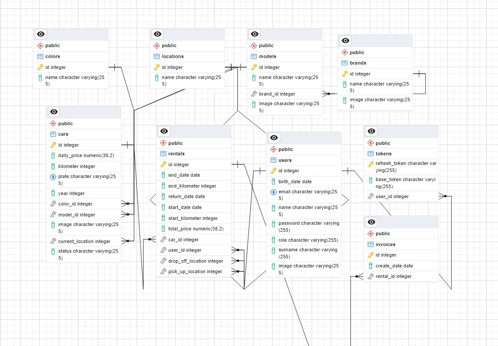

## Project Description
   The car rental website is a platform owned by a single car rental company where users can carry out car rental processes online. This website allows users to select the vehicles they desire (based on the dealerships or locations where the vehicles are located) and manage the rental process. Additionally, the site incorporates a membership system for both users and administrators. It enables the owner and administrators of the car rental company to add, delete, read, and update user information, vehicle information, model information related to vehicles, and rental information, except for exceptional circumstances and needs. The documentation encompasses the general description and objectives of the car rental website project. In subsequent sections, topics such as project architecture, technologies, and tools used will be discussed in detail.

---
 

## Objectives
The main objectives of this project are as follows:
   ### User-Friendly Interface
Users can easily search, filter, and select vehicles. They can visually inspect vehicles, view their technical specifications, and quickly become members to rent them.
### Flexible Rental Conditions
Users can rent vehicles by entering their desired date range (up to 25 days maximum) and utilizing the dealership that suits them best.
### Management Panel for Dealership Owners and Managers
The website provides a special management panel for dealership or company owners, enabling them to track their vehicles, users, rental information, and vehicle model details. They can intervene by deleting, editing as needed, and ultimately adding new entries.

---
 

## Architectural Features
The project utilizes Java and React technologies and follows an N-tier architectural pattern with a monolithic structure. The architectural features of the car rental website project include:
### Technology Stack
- **Server-side (Back-end):** Java with Spring framework was used. Spring Boot was chosen for its ability to facilitate rapid and easy application development.
- **Client-side (Front-end):** A modern and interactive user interface (SPA - Single Page Application) was developed using React.
- **Database:** PostgreSQL was used as the database.

### Monolithic Structure
The car rental website has a monolithic structure where all functionalities are housed within a single application. This approach initially provides a simpler deployment and management process. Essentially, there are three main layers:

- **Server Layer (Back-end):** This layer contains the business logic and provides RESTful APIs developed using Spring Boot.
- **Client Layer (Front-end):** This layer houses the user interface, with a modern web interface built using React.
- **Data Access Layer:** This layer facilitates communication with the database, performing database operations using Spring Data JPA.

### Architectural Diagram
Below is a diagram illustrating the project architecture of the car rental website:

